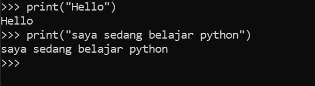
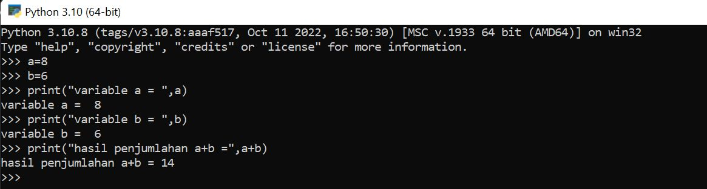
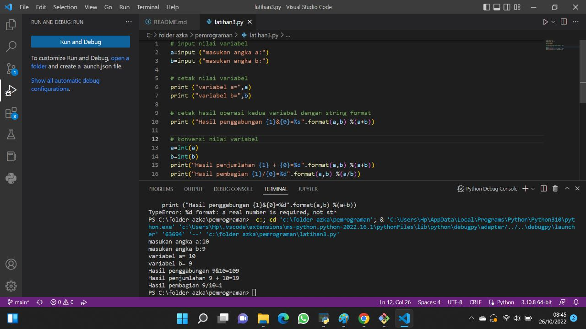

# lab2py
## Menjalankan Python Console
### 1. Pastikan python sudah terinstal pada laptop
### 2. Buka CMD dengan cara klik windows+r lalu klik ok
### 3. Menampilkan Latihan1 python, "Hello" dan "Saya sedang belajar python"

### 4. Menampilkan latihan2 python, menjumlahkan dua buah bilangan menggunakan variabel a dan b

## Menjalankan IDLE
###     1. IDLE ini adalah teks editor bawaan python yang sudah otomatis terinstal
###     2. Menjalankan IDLE 
####     - Membuat fungsi input untuk mengambil nilai variabel
####     - Mencetak hasil inputan
####    - Mencetak hasil inputan variabel dengan format string
####     - Konversi nilai variabel
####     - Hasil dari program 
